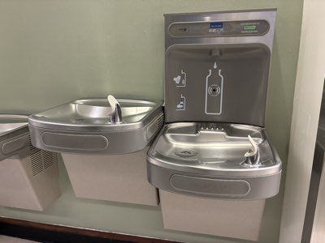

## Weekly Meetings

We hold weekly lab meetings open to anyone interested. Come by, see what we're working on, and meet the team — no commitment required.

**Location:** [Green Hall, GR 3.316](https://map.concept3d.com/?id=1772#!m/550863?share){target="_blank"} (Thomas Spencer Hall)

## Student Research Opportunities

PRISE Lab offers hands-on research experience for undergraduate and graduate students at UT Dallas. No prior research experience is required — just genuine interest and reliability. We mentor students through every step of the research process.

**Interested? [Apply here.](https://profiles.utdallas.edu/students/create){target="_blank"}**

## Current Opportunities

::: {.opportunity-card}

::: {.opportunity-content}
### Campus Drinking Water Quality Study

[[UTD Green Fund](https://studentaffairs.utdallas.edu/initiatives/green-fund/){target="_blank"} student-led research initiative (Fall 2026)]{.subtitle}

Testing campus drinking water for PFAS, lead, and other contaminants; surveying willingness to pay for improvements; recruiting students from environmental science, social science, and engineering.

[Learn more →](projects/water-quality.qmd)
:::

:::
