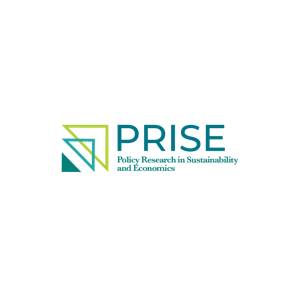

::: {.hero}
{.hero-logo}

UT Dallas · School of Economic, Political and Policy Sciences
:::

{.group-photo}

## About

PRISE is a research hub at UT Dallas dedicated to understanding and solving critical challenges in environmental sustainability, energy, and economic inequality. We focus on the human impact of environmental and economic shocks, particularly how they affect marginalized populations.

Our research spans hurricane impacts in the U.S., tropical forest losses, energy access in sub-Saharan Africa, and pollution effects worldwide.

## Research Areas

::: {.card}
### Climate and Political Accountability
How extreme weather events shape election outcomes and climate policy.
:::

::: {.card}
### Conservation Program Effectiveness
Optimizing conservation funding — evidence from Vietnam and beyond.
:::

::: {.card}
### Clean Energy Adoption
Household adoption of energy-efficient cooking appliances in Uganda.
:::

::: {.card}
### Land-Use Change and Deforestation
Political economy of deforestation in Brazil and Indonesia using remote sensing and causal analysis.
:::
