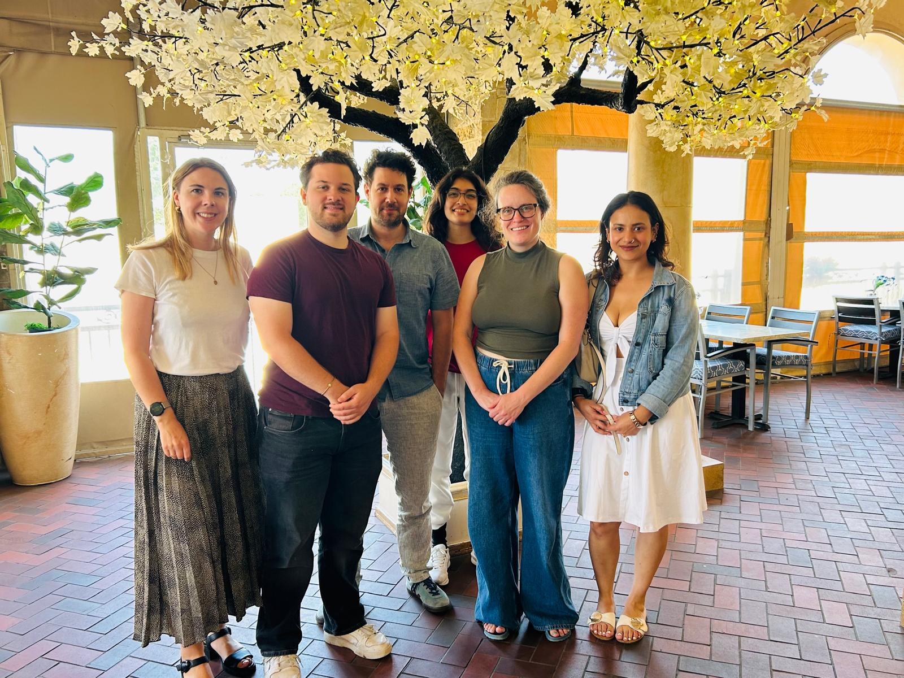
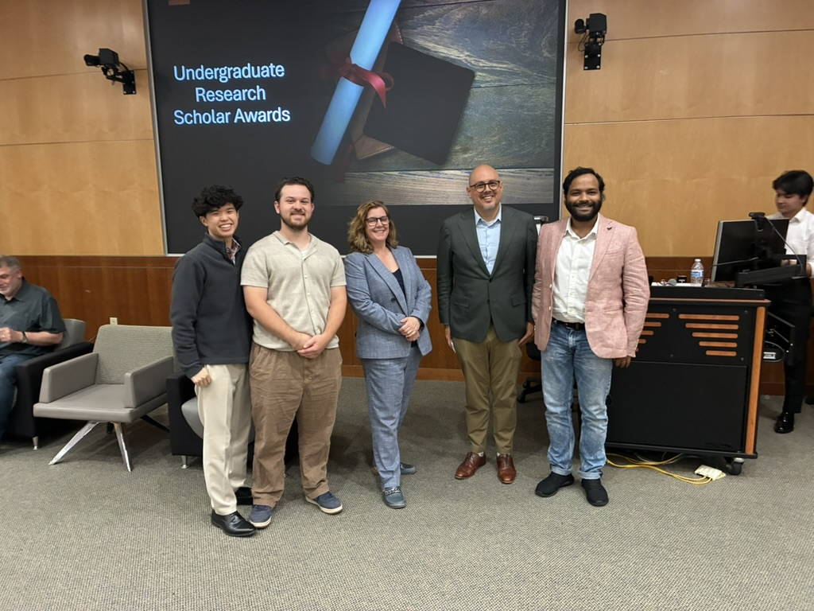

## 2026

**May 2026** - We celebrated the end of the school year with a group lunch, saying goodbye to our graduating seniors [Aria Abhyankar](team.qmd), [Nyma Anisa Ehtesham](team.qmd), and [Joey Rogers](team.qmd)!

{width="50%"}

**May 2026** - Undergraduate student [Joey Rogers](team.qmd) won the EPPS Undergraduate Research Scholar Award for his research on drought and deforestation in Vietnam!

{width="50%"}

**April 2026** - PhD students [Kayleigh Tompkins](team.qmd) and [Mamie Cincotta](team.qmd) presented their work on hurricanes and voter behavior at the Midwest Political Science Association (MPSA) Conference in Chicago.

**April 2026** - PhD student [Yiqun Yu](team.qmd) presents his research linking temperature change and other climate shocks to learning outcomes in East Africa at the 4th Annual Texas Applied Microeconomics Student (TEAMS) workshop at Rice University.

**April 2026** - Undergraduate student [Joey Rogers](team.qmd) presents his research "When the River Runs Dry: Drought and Deforestation in Vietnam Forest Policy" at UT-D's Undergraduate Research Scholar Awards Poster Contest Symposium.

**April 2026** — PRISE Lab seeking students to apply for UTD Green Fund campus drinking water quality study. [Learn more](projects/water-quality.qmd) if interested.

**April 2026** — PRISE Lab website goes live.
