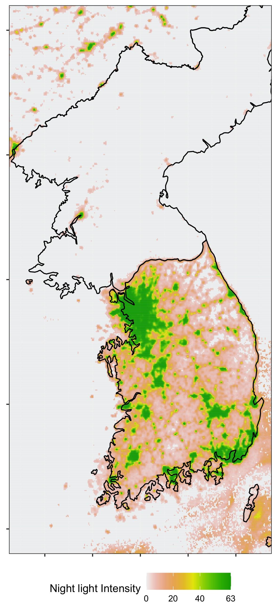

Economists increasingly use satellite nighttime lights as a proxy for local economic activity — and our lab is taking a close look at how robust those results really are. We are assembling a library of replication packages from published papers that use nightlight data, and we need a student to help us read through them and pull out what matters.

Your role is to go paper by paper and tell me, in plain language, where the nightlight data actually shows up in each study's main results. No prior research experience is required — these are skills you will learn on the job, with my guidance.

**What you will do**

- Read assigned papers and their replication packages.
- Identify which regressions and figures use nightlight data, and flag the ones the authors treat as the main result.
- Keep a short structured log so we can compare findings across papers.

**What you get**

- Hands-on training in how to read, interpret, and evaluate empirical economics research.
- A front-row seat to an active research project at the intersection of remote sensing and development economics.
- Direct mentorship from Dr. Cisneros and a strong letter of recommendation for future applications.

**Who we are looking for**

Any motivated UT Dallas undergraduate with curiosity about economics or environmental research and a willingness to read carefully. No prior coursework in econometrics or GIS required.

**Interested?**

Email [elias.cisneros@utdallas.edu](mailto:elias.cisneros@utdallas.edu) with a short note about yourself and why you would like to join.
