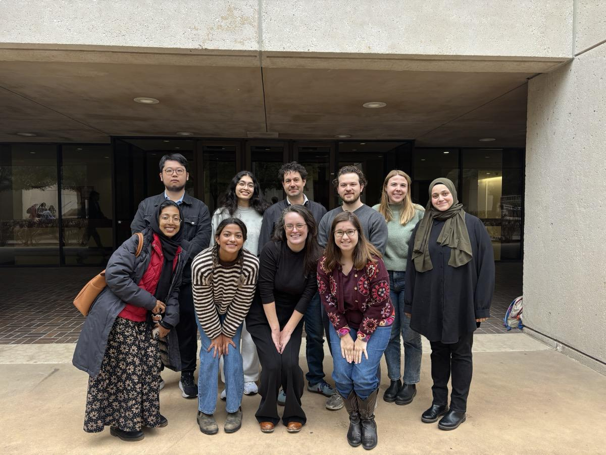
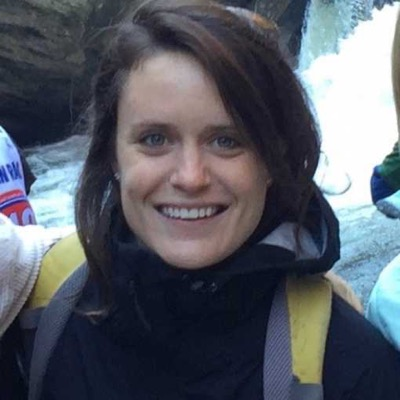
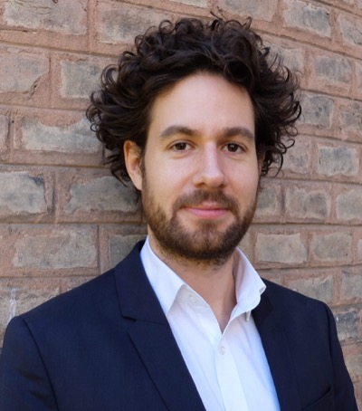
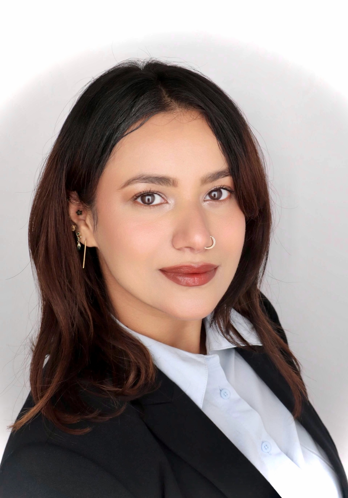

{.group-photo}

## Faculty

::: {.team-grid}

::: {.team-member}

### Dr. Erin Litzow
[Applied economist]{.role}

Environmental, development, and energy economics. Research across 11 countries in Africa and Latin America. Affiliated with Duke Energy Access Project and Environment for Development.

[Website](https://sites.google.com/site/erinlitzow/home){target="_blank"} · [erin.litzow@utdallas.edu](mailto:erin.litzow@utdallas.edu)
:::

::: {.team-member}

### Dr. Elías Cisneros
[Political economist]{.role}

Political economy of land-use change and deforestation in Brazil and Indonesia. Remote sensing and causal analysis methods.

[Website](https://eliascis.github.io/){target="_blank"} · [elias.cisneros@utdallas.edu](mailto:elias.cisneros@utdallas.edu)
:::

:::

## Graduate Student Researchers

::: {.team-grid}

::: {.team-member}

### Sonali Singh
[PhD candidate, Public Policy & Political Economy]{.role}

Climate variability, human capital, and political economy. Research on extreme heat and educational outcomes, weather shocks in India, and patent reforms in emerging markets. UT System Graduate Archer Fellow and NSF-funded EITM Scholar.
:::

:::

*We are always looking for motivated students. If you are interested in joining the lab, reach out to either faculty member.*
