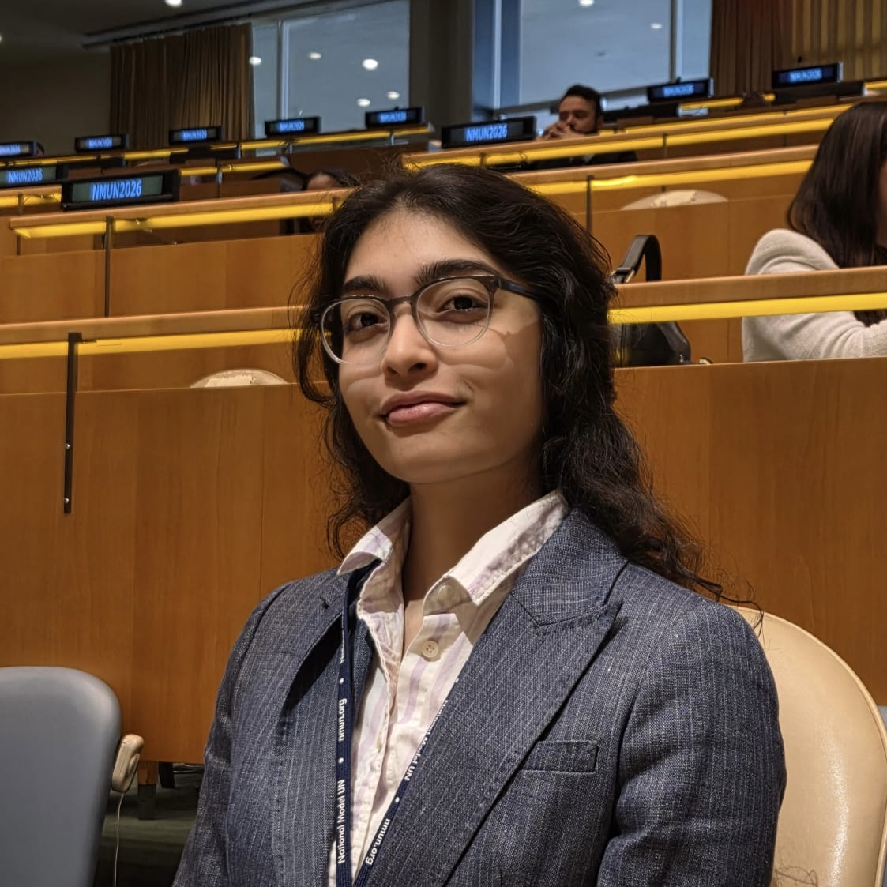
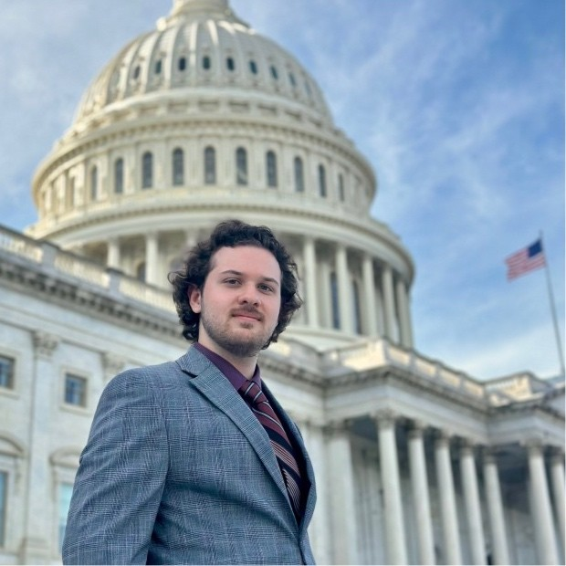

{.group-photo}

## Faculty

::: {.team-grid}

::: {.team-member}

### Dr. Erin Litzow
[Applied economist]{.role}

Environmental, development, and energy economics. Research across 11 countries in Africa and Latin America. Affiliated with Duke Energy Access Project and Environment for Development.

[Website](https://sites.google.com/site/erinlitzow/home){target="_blank"} · [erin.litzow@utdallas.edu](mailto:erin.litzow@utdallas.edu)
:::

::: {.team-member}

### Dr. Elías Cisneros
[Environmental economist]{.role}

Political economy of land-use change and deforestation in Brazil and Indonesia. Remote sensing and causal analysis methods.

[Website](https://eliascis.github.io/){target="_blank"} · [elias.cisneros@utdallas.edu](mailto:elias.cisneros@utdallas.edu)
:::

:::

## Graduate Student Researchers

::: {.team-grid}

::: {.team-member}

### Sonali Singh
[PhD candidate, Public Policy & Political Economy]{.role}

Climate variability, human capital, and political economy. Research on extreme heat and educational outcomes, weather shocks in India, and patent reforms in emerging markets. UT System Graduate Archer Fellow and NSF-funded EITM Scholar.
:::

::: {.team-member}

### Kayleigh Tompkins
[Graduate student, Public Policy & Political Economy]{.role}

[LinkedIn](https://www.linkedin.com/in/kayleigh-tompkins/){target="_blank"} · [kayleigh.tompkins@utdallas.edu](mailto:kayleigh.tompkins@utdallas.edu)
:::

::: {.team-member}

### Mamie Cincotta
[Graduate student, Public Policy & Political Economy]{.role}

[Mamie.Cincotta@utdallas.edu](mailto:Mamie.Cincotta@UTDallas.edu)
:::

::: {.team-member}

### Deena Essa
[Graduate student, Public Policy & Political Economy]{.role}

[deena.essa@utdallas.edu](mailto:deena.essa@utdallas.edu)
:::

::: {.team-member}

### Yiqun Yu
[Graduate student, Economics]{.role}

[LinkedIn](https://www.linkedin.com/in/yiqun-yu-527003180/){target="_blank"} · [Yiqun.Yu@utdallas.edu](mailto:Yiqun.Yu@UTDallas.edu)
:::

::: {.team-member}

### Partha Chowdhury
[Graduate student, Political Science]{.role}

[Partha.Chowdhury@utdallas.edu](mailto:Partha.Chowdhury@UTDallas.edu)
:::

:::

## Undergraduate Student Researchers

::: {.team-grid}

::: {.team-member}

### Aria Abhyankar
[Undergraduate student, International Political Economy]{.role}

Senior thesis on the U.S. prison system and environmental quality. UTD Sustainability Honors recipient (2025) with a full scholarship for study abroad in Amsterdam and Brussels on international law and politics. Chaired the SEPPS Dean's Council; graduating summa cum laude in May 2026.

[Aria.Abhyankar@utdallas.edu](mailto:Aria.Abhyankar@UTDallas.edu)
:::

::: {.team-member}

### Joey Rogers
[Undergraduate student]{.role}

[LinkedIn](https://www.linkedin.com/in/joseph-rogers-320abb2a1/){target="_blank"} · [Joseph.Rogers2@utdallas.edu](mailto:Joseph.Rogers2@UTDallas.edu)
:::

::: {.team-member}

### Nyma Anisa Ehtesham
[Undergraduate student, International Political Economy]{.role}

[Nyma.Ehtesham@utdallas.edu](mailto:Nyma.Ehtesham@UTDallas.edu)
:::

:::

*We are always looking for motivated students. If you are interested in joining the lab, reach out to either faculty member.*
