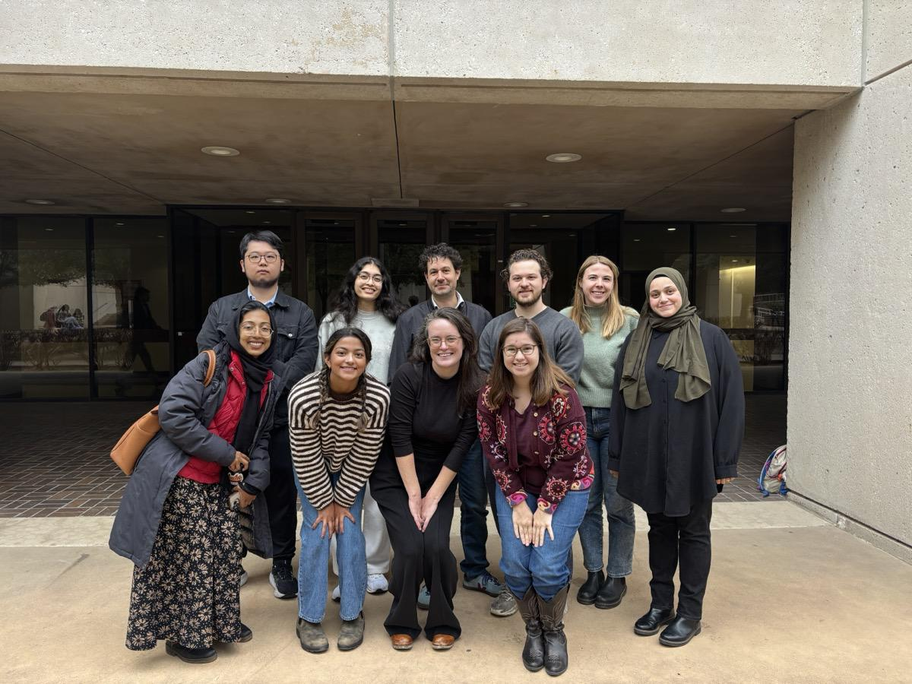
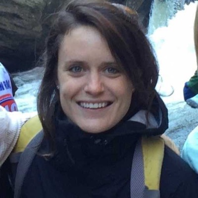
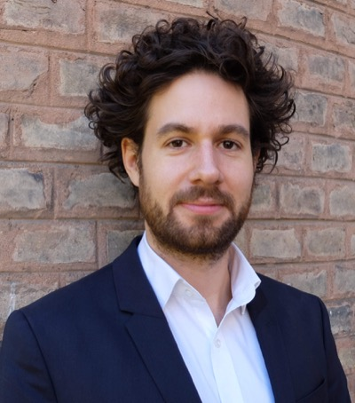
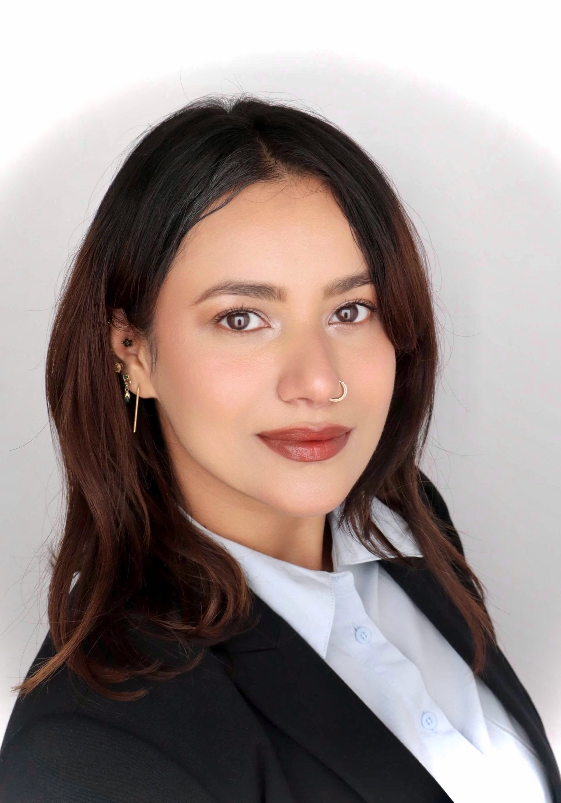
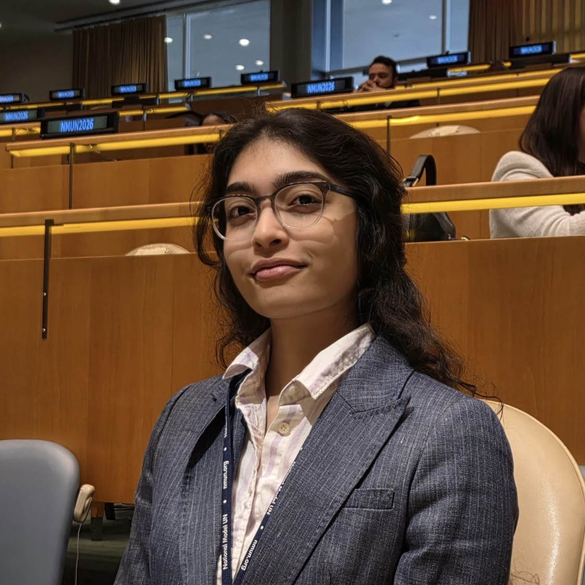
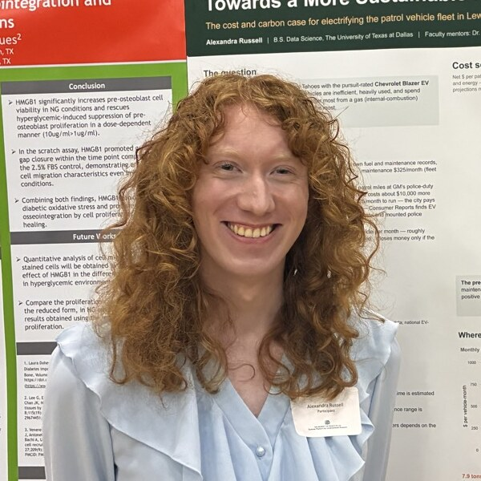
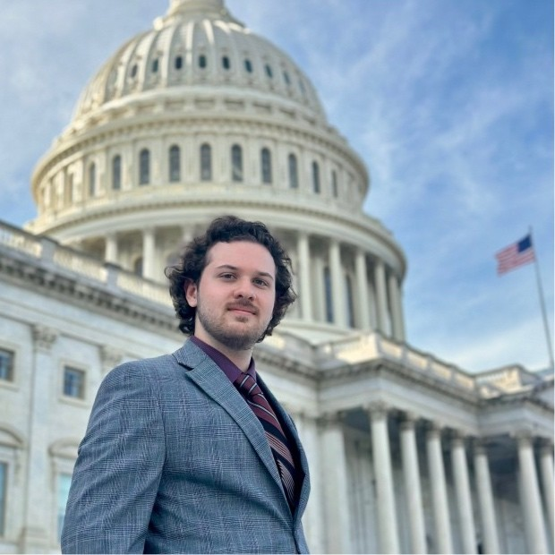

{.group-photo}

## Faculty

::: {.team-grid}

::: {.team-member}

### Dr. Erin Litzow
[Applied economist]{.role}

Environmental, development, and energy economics. Research across 11 countries in Africa and Latin America. Affiliated with Duke Energy Access Project and Environment for Development.

[Website](https://sites.google.com/site/erinlitzow/home){target="_blank"} · [erin.litzow@utdallas.edu](mailto:erin.litzow@utdallas.edu)
:::

::: {.team-member}

### Dr. Elías Cisneros
[Environmental economist]{.role}

Political economy of land-use change and deforestation in Brazil and Indonesia. Remote sensing and causal analysis methods.

[Website](https://eliascis.github.io/){target="_blank"} · [elias.cisneros@utdallas.edu](mailto:elias.cisneros@utdallas.edu)
:::

:::

## Student Researchers

::: {.student-team-list}

::: {.team-member}

::: {.student-member-content}
### Sonali Singh
[PhD candidate, Public Policy & Political Economy]{.role}

Climate variability, human capital, and political economy. Research on extreme heat and educational outcomes, weather shocks in India, and patent reforms in emerging markets. UT System Graduate Archer Fellow and NSF-funded EITM Scholar.

[LinkedIn](https://www.linkedin.com/in/sonalisinghh/){target="_blank"} · [sonali.singh2@utdallas.edu](mailto:sonali.singh2@utdallas.edu)
:::
:::

::: {.team-member}

::: {.student-member-content}
### Kayleigh Tompkins
[Graduate student, Public Policy & Political Economy]{.role}

[LinkedIn](https://www.linkedin.com/in/kayleigh-tompkins/){target="_blank"} · [kayleigh.tompkins@utdallas.edu](mailto:kayleigh.tompkins@utdallas.edu)
:::
:::

::: {.team-member}

::: {.student-member-content}
### Mamie Cincotta
[Graduate student, Public Policy & Political Economy]{.role}

[Mamie.Cincotta@utdallas.edu](mailto:Mamie.Cincotta@UTDallas.edu)
:::
:::

::: {.team-member}

::: {.student-member-content}
### Deena Essa
[Graduate student, Public Policy & Political Economy]{.role}

[deena.essa@utdallas.edu](mailto:deena.essa@utdallas.edu)
:::
:::

::: {.team-member}

::: {.student-member-content}
### Yiqun Yu
[Graduate student, Economics]{.role}

[LinkedIn](https://www.linkedin.com/in/yiqun-yu-527003180/){target="_blank"} · [Yiqun.Yu@utdallas.edu](mailto:Yiqun.Yu@UTDallas.edu)
:::
:::

::: {.team-member}

::: {.student-member-content}
### Partha Chowdhury
[Graduate student, Political Science]{.role}

[Partha.Chowdhury@utdallas.edu](mailto:Partha.Chowdhury@UTDallas.edu)
:::
:::

::: {.team-member}

::: {.student-member-content}
### Aria Abhyankar
[Undergraduate student, International Political Economy]{.role}

Senior thesis on the U.S. prison system and environmental quality. UTD Sustainability Honors recipient (2025) with a full scholarship for study abroad in Amsterdam and Brussels on international law and politics. Chaired the SEPPS Dean's Council; graduating summa cum laude in May 2026.

[Aria.Abhyankar@utdallas.edu](mailto:Aria.Abhyankar@UTDallas.edu)
:::
:::

::: {.team-member}

::: {.student-member-content}
### Alexandra Russell
[Undergraduate student, Data Science]{.role}

Cost and carbon analysis of municipal fleet electrification. Presented "Towards a More Sustainable Police Fleet," on electrifying the patrol vehicle fleet in Lewisville, Texas, at UT-D's SPUR 2026 Summer Undergraduate Research Poster Competition.

[alexandra.russell@utdallas.edu](mailto:Grady.Russell@UTDallas.edu)
:::
:::

:::

## Former Team Members

::: {.student-team-list}

::: {.team-member}

::: {.student-member-content}
### Joey Rogers
[Former undergraduate student]{.role}

[LinkedIn](https://www.linkedin.com/in/joseph-rogers-320abb2a1/){target="_blank"} · [Joseph.Rogers2@utdallas.edu](mailto:Joseph.Rogers2@UTDallas.edu)
:::
:::

::: {.team-member}

::: {.student-member-content}
### Nyma Anisa Ehtesham
[Former undergraduate student]{.role}

[Nyma.Ehtesham@utdallas.edu](mailto:Nyma.Ehtesham@UTDallas.edu)
:::
:::

:::
